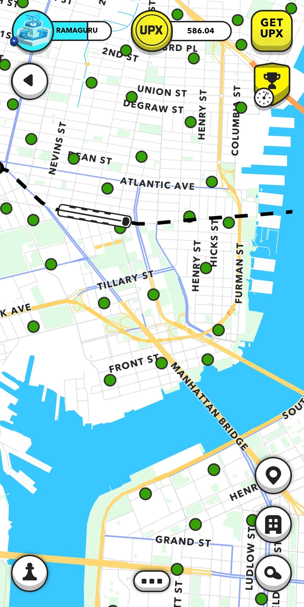
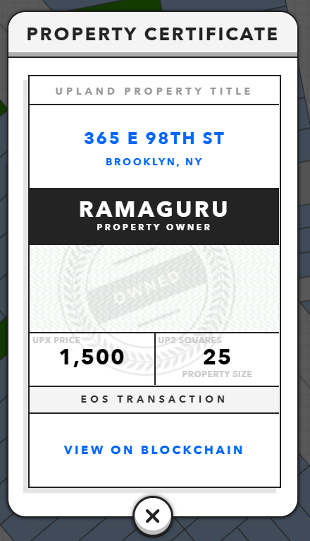
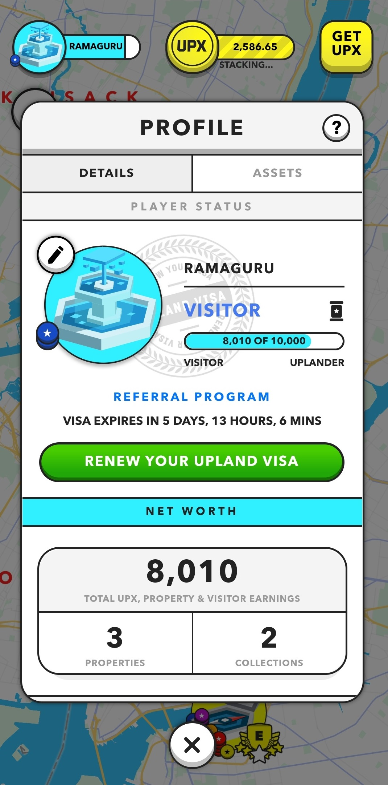
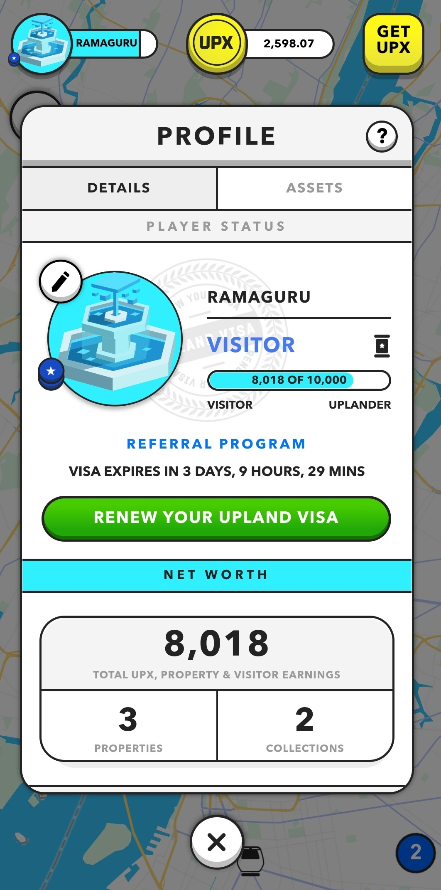
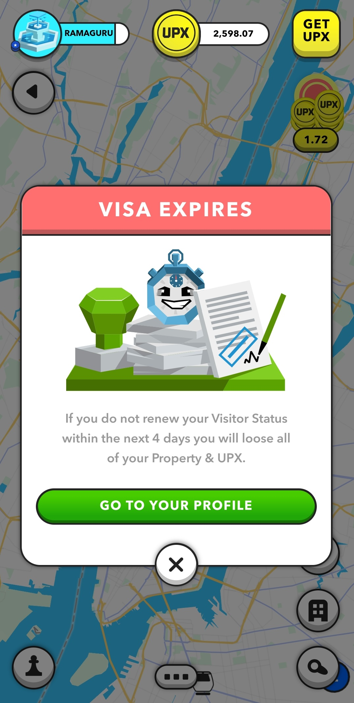

# Upland

[Upland](https://www.upland.me/) is a parallel multiverse revolving around commerce, entertainment and personal connections. Buy, sell, trade and collect properties, develop them, build structures, create real businesses that provide products or services. Eventually, only the sky's the limit (literally). 
Each property in the platform is a NFT (unique digital item of which no two are the same and no single one can be owned by multiple parties). The record of an NFT’s ownership is notarized on the blockchain, which acts as a decentralized ledger of transactions, meaning there really is one, and only one, single user owns it. 
Buy, sell, trade and collect properties, develop them, build structures, create real businesses that provide products or services. Eventually, only the sky's the limit (literally). 

# Details

| Domain | Virtual World, Trading Game | 
|---|---|
| Platform | EOS | 
| Token | UPX | 

# Application

 

 

  

  
# Credits
Ramaguru Radhakrishnan (@ramagururadhakrishnan)
